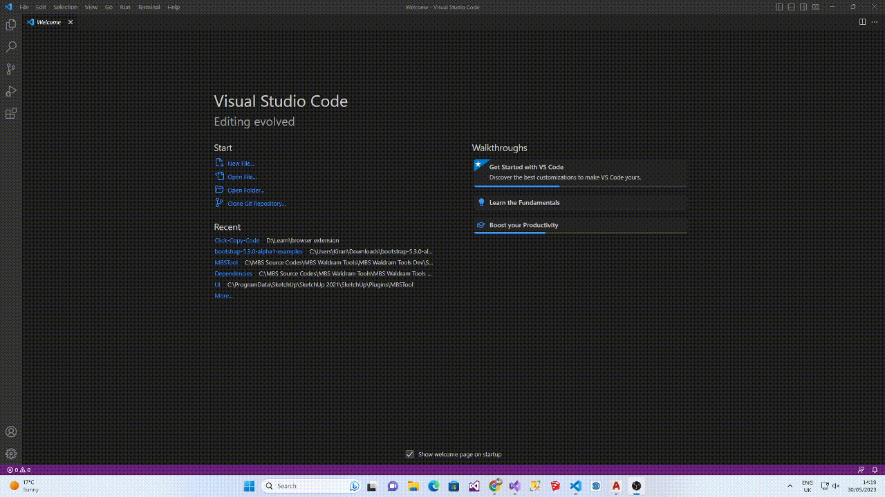

# Click Copy {Code}

[Google Chrome](https://chrome.google.com/webstore/detail/click-copy-%7Bcode%7D/kjbnobdekbdpankopjnpjklfgklhcjeo) extension to copy codeblock from any website on simply double click. 

## Preview

## Shortcut

Press `Alt+C` to enable or disable copying. A toast will indicate the current state.
The extension remembers your choice for future pages.

## Options

The options page lets you opt-in to anonymous copy count collection. When enabled,
the extension stores how many snippets you copy each day and shows today's and
the last week's totals. You can export the data as JSON or reset the counts from
that page.
